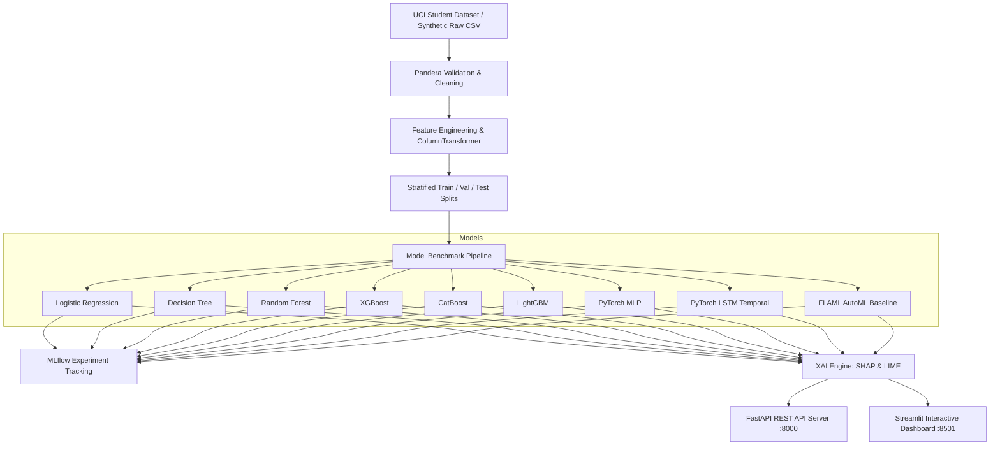

# Explainable Student Performance Prediction Platform

[](https://github.com/user/student-performance-platform/actions)
[](https://www.python.org/downloads/release/python-3110/)
[](https://opensource.org/licenses/MIT)

The end-to-end Machine Learning platform for predicting student academic performance and explaining model predictions using **SHAP** and **LIME**.

---

## Architecture & System Design



---

## Quick Start (Local Setup)

### 1. Environment Setup
```bash
# Activate virtual environment (LabX-Global)
call LabX-Global.bat

# Install dependencies and package in editable mode
pip install -r requirements.txt
pip install -e .
```

### 2. Data Pipeline & Model Training
```bash
# Run data ingestion, Pandera validation, cleaning, and feature engineering
python -m student_perf.data.ingest
python -m student_perf.features.pipeline

# Train all 9 models, log to MLflow, and produce SHAP/LIME plots
python -m student_perf.models.train_all
```

### 3. Launch Services
```bash
# Launch FastAPI REST API (Swagger UI at http://localhost:8000/docs)
uvicorn student_perf.api.main:app --reload --host 0.0.0.0 --port 8000

# Launch Streamlit Interactive Dashboard (http://localhost:8501)
streamlit run src/student_perf/dashboard/app.py

# Launch MLflow UI (http://localhost:5000)
mlflow ui
```

---

## Docker Deployment

Run all services (API, Dashboard, MLflow UI) seamlessly via Docker Compose:

```bash
docker-compose up --build
```

- **API Endpoint:** `http://localhost:8000` (Health check: `/health`, Docs: `/docs`)
- **Streamlit Dashboard:** `http://localhost:8501`
- **MLflow Tracking UI:** `http://localhost:5000`

---

## Model Benchmarks

| Model | Type | Handles Categoricals? | Needs Scaling? | Primary Metric |
|---|---|---|---|---|
| **Logistic Regression** | Linear Baseline | Encoded | Yes | F1 / Accuracy |
| **Decision Tree** | Tree | Encoded | No | F1 / Accuracy |
| **Random Forest** | Tree Ensemble | Encoded | No | F1 / Accuracy |
| **XGBoost** | Gradient Boosting | Encoded | No | F1 / Accuracy |
| **CatBoost** | Gradient Boosting | Native | No | F1 / Accuracy |
| **LightGBM** | Gradient Boosting | Native | No | F1 / Accuracy |
| **PyTorch MLP** | Deep Learning | Encoded | Yes | F1 / Accuracy |
| **PyTorch LSTM** | Sequential DL | Encoded | Yes | F1 / Accuracy |
| **FLAML AutoML** | Best-of-many | Auto | Auto | F1 / Accuracy |

*All model metrics, training times, and inference latencies are exported to `data/processed/metrics_summary.csv` and logged to MLflow.*

---

## Explainability

The platform provides dual-explanation capabilities:
- **SHAP (SHapley Additive exPlanations):** Global beeswarm summary plots, feature importance bar charts, and individual waterfall plots (`TreeExplainer` for trees, `LinearExplainer` for linear, `KernelExplainer` for NNs).
- **LIME (Local Interpretable Model-agnostic Explanations):** Model-agnostic local feature attribution saved as HTML and normalized JSON.
- **Agreement Metric:** Calculates Spearman rank correlation between SHAP and LIME feature importance for individual student predictions.

---

## Testing

Run the full test suite with coverage:

```bash
pytest tests/ -v --cov=src --cov-report=term-missing
```

---

## Credits & Sources

| Component | Source |
| -------------------------- | ------------------------------ |
| Dataset selection | OULAD, UCI Student Performance |
| Feature engineering | Book |
| ML baselines | Book |
| Deep learning models | Book |
| Explainability (SHAP/LIME) | Book |
| Dashboard | Own implementation |
| API | Own implementation |
| Deployment | Own implementation |

---

## 📝 Project Structure

```
student-performance-platform/
├── configs/               # YAML configuration files (data, model, logging)
├── data/                  # raw, interim, processed splits & figures
├── docker/                # Dockerfiles for API, Dashboard, Train
├── docker-compose.yml     # Container orchestration
├── mlruns/                # MLflow tracking store
├── src/student_perf/      # Source code package
│   ├── api/               # FastAPI endpoints & schemas
│   ├── dashboard/         # Streamlit interactive UI
│   ├── data/              # Ingestion, Pandera validation, cleaning
│   ├── evaluation/        # Metrics & comparison leaderboard
│   ├── explain/           # SHAP & LIME explainers
│   ├── features/          # ColumnTransformer & feature engineering
│   ├── models/            # 9 model implementations (sklearn, PyTorch, FLAML)
│   └── tracking/          # MLflow logging utilities
├── tests/                 # Pytest suite
├── .github/workflows/ci.yml # GitHub Actions CI
├── Makefile               # CLI automation targets
├── pyproject.toml         # Build backend & package spec
├── requirements.txt       # Pinned dependencies
├── PROGRESS.md            # Execution changelog
└── README.md              # Project documentation
```
